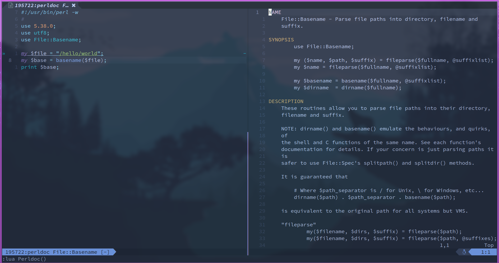

# perldoc.nvim

A simple way to open perldoc in nvim. Only support for functions not methodes.

# Features

It will open the `perldoc xxx::xxx` about the function under cursor on the right side of current window:



You can also place the cursor on a module name to open `perldoc`.

# Installation

Support for `Lazy.nvim` to install:

```lua
{
  "zKurisu/perldoc.nvim",
  lazy = false,
  config = function()
    require('perldoc')
  end
}
```

For other ways, you can change the variable `vim.g.perldoc_install_path` to where the plugin is, the default value is:

```lua
vim.g.perldoc_install_path = os.getenv("HOME") .. '/.local/share/nvim/lazy/perldoc.nvim'
```

# Keymap

The default keybinding is `gh` when the filetype is `perl`, you can change it by reset the `vim.g.perldoc_keymap` variable:

    vim.g.perldoc_keymap = { "n", "gh", ":lua Perldoc()<CR>" }


